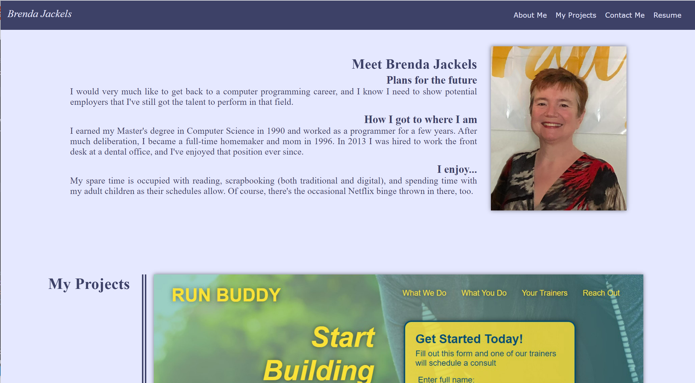

# My Portfolio
This second challenge for the Coding Bootcamp is to create a portfolio page for ourselves. This project was created from scratch. I left some placeholders to display future work as well as for my resume. I'll add my actual resume as I get closer to finishing the bootcamp.

[Requirements](#requirements)

[Additional Work Done](#additionalWork)

[What I Learned](#whatILearned)

[Portfolio Screenshot](#webImage)

[Contact Me](#contactMe)

---

## Requirements
Our Portfolio had the following minimum requirements:
* Present my name, a recent photo or avatar, and links to sections about me, my work, and how to contact me
* Clicking the navigation links should scroll to the corresponding section
* The section showcasing my work should have titled images of my applications
* The first application should be presented larger
* Clicking on the application image should take me to that deployed application
* The portfolio should work when the page is resized or viewed on different screens and devices
---

## Additional Work
I included a few things that weren't specifically required:
* A button to download my resume
* The work section looked sad with all those placeholders, so added some images from previous jobs and linked to another html that has a brief description of each of my previous jobs. I didn't put a whole lot of effort into that extra html file since it will all get replaced as I have more projects to add to this section. 
* The menu bar sticks to the top of the page
* The first item in the menu bar, my name, disappears in smaller sizes
---

## What I Learned
* Getting the menu bar items to scroll properly required learning about the scroll-margin-top attribute
* I still have much to learn about flex layouts, but I've gotten a good start with this project.
* I re-learned that often times instructors don't have the answer, but they know how to find the answer. Hopefully as I get better at this, I'll be able to find the answer myself. Currently, I sometimes don't know what terms to use when searching to get a good answer.
* I learned that I still have a lot to learn about correct image handling, but I think I have the basics down now.
* Turns out I do not like the look of shadowed text, so I didn't use it anywhere.
---
## Portfolio Screenshot

---

## Contact Me
You can reach me, Brenda Jackels, at bjackels5@gmail.com.